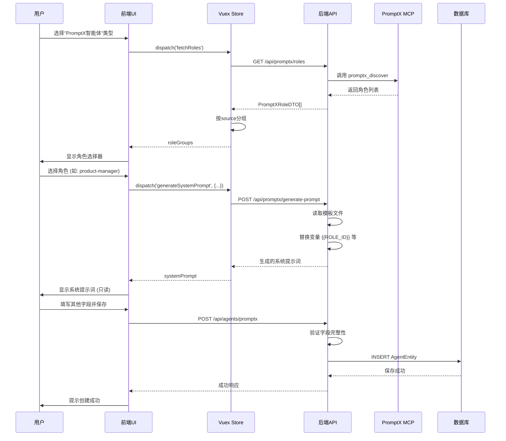
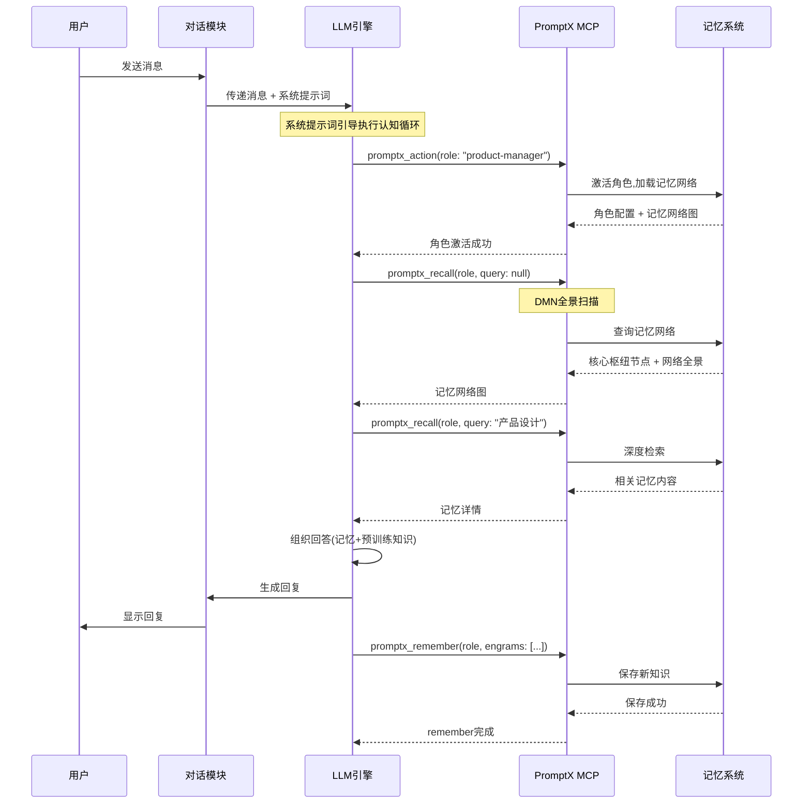

# Data Model: PromptX智能体集成

**Date**: 2025-12-02
**Feature**: PromptX智能体集成
**Based On**: research.md技术研究结果

## 概述

本文档定义PromptX智能体集成所需的数据模型,包括数据库Schema扩展、Java实体类、前端数据结构和状态管理。

---

## 1. 数据库Schema

### 1.1 现有表扩展

#### ai_agent表扩展

```sql
-- 表名: ai_agent
-- 描述: 智能体配置主表
-- 扩展: 添加PromptX智能体类型支持

ALTER TABLE ai_agent
ADD COLUMN agent_type VARCHAR(50) DEFAULT 'normal'
COMMENT '智能体类型: normal(普通智能体) | promptx(PromptX智能体)'
AFTER system_prompt;

ALTER TABLE ai_agent
ADD COLUMN promptx_role_id VARCHAR(100) NULL
COMMENT 'PromptX角色ID, 如: product-manager, java-developer'
AFTER agent_type;

ALTER TABLE ai_agent
ADD COLUMN promptx_role_source VARCHAR(50) NULL
COMMENT 'PromptX角色来源: system(系统级) | project(项目级) | user(用户级)'
AFTER promptx_role_id;

-- 索引
CREATE INDEX idx_agent_type ON ai_agent(agent_type);
CREATE INDEX idx_promptx_role ON ai_agent(promptx_role_id);

-- 约束
ALTER TABLE ai_agent
ADD CONSTRAINT chk_agent_type
CHECK (agent_type IN ('normal', 'promptx'));

ALTER TABLE ai_agent
ADD CONSTRAINT chk_promptx_role_source
CHECK (promptx_role_source IS NULL OR promptx_role_source IN ('system', 'project', 'user'));

-- 数据迁移
UPDATE ai_agent SET agent_type = 'normal' WHERE agent_type IS NULL;
```

**字段说明**:

| 字段名 | 类型 | 必填 | 默认值 | 说明 |
|-------|------|------|--------|------|
| `agent_type` | VARCHAR(50) | 是 | 'normal' | 智能体类型标识 |
| `promptx_role_id` | VARCHAR(100) | 否 | NULL | PromptX角色唯一标识符 |
| `promptx_role_source` | VARCHAR(50) | 否 | NULL | 角色来源标识 |

**业务规则**:
- `agent_type = 'normal'` 时,`promptx_role_id`和`promptx_role_source`必须为NULL
- `agent_type = 'promptx'` 时,`promptx_role_id`和`promptx_role_source`必须有值
- `system_prompt`字段在PromptX智能体中存储生成的完整系统提示词

#### ai_agent_template表扩展

```sql
-- 表名: ai_agent_template
-- 描述: 智能体模板配置表
-- 扩展: 与ai_agent表相同的字段

ALTER TABLE ai_agent_template
ADD COLUMN agent_type VARCHAR(50) DEFAULT 'normal'
COMMENT '智能体类型: normal | promptx'
AFTER system_prompt;

ALTER TABLE ai_agent_template
ADD COLUMN promptx_role_id VARCHAR(100) NULL
COMMENT 'PromptX角色ID'
AFTER agent_type;

ALTER TABLE ai_agent_template
ADD COLUMN promptx_role_source VARCHAR(50) NULL
COMMENT 'PromptX角色来源: system | project | user'
AFTER promptx_role_id;

CREATE INDEX idx_template_agent_type ON ai_agent_template(agent_type);
CREATE INDEX idx_template_promptx_role ON ai_agent_template(promptx_role_id);

ALTER TABLE ai_agent_template
ADD CONSTRAINT chk_template_agent_type
CHECK (agent_type IN ('normal', 'promptx'));

UPDATE ai_agent_template SET agent_type = 'normal' WHERE agent_type IS NULL;
```

### 1.2 数据完整性验证查询

```sql
-- 验证1: 检查所有智能体都有类型
SELECT COUNT(*) AS invalid_count
FROM ai_agent
WHERE agent_type IS NULL;
-- 预期结果: 0

-- 验证2: 检查PromptX智能体的字段完整性
SELECT id, agent_name, agent_type, promptx_role_id, promptx_role_source
FROM ai_agent
WHERE agent_type = 'promptx'
AND (promptx_role_id IS NULL OR promptx_role_source IS NULL);
-- 预期结果: 空集

-- 验证3: 检查普通智能体的字段清洁性
SELECT id, agent_name, agent_type, promptx_role_id, promptx_role_source
FROM ai_agent
WHERE agent_type = 'normal'
AND (promptx_role_id IS NOT NULL OR promptx_role_source IS NOT NULL);
-- 预期结果: 空集
```

---

## 2. Java实体类

### 2.1 AgentEntity (后端)

```java
package com.xinnan.xiaozhi.entity;

import com.baomidou.mybatisplus.annotation.*;
import io.swagger.v3.oas.annotations.media.Schema;
import lombok.Data;
import java.util.Date;

/**
 * 智能体配置实体
 * 扩展支持PromptX智能体类型
 */
@Data
@TableName("ai_agent")
@Schema(description = "智能体配置")
public class AgentEntity {

    @TableId(type = IdType.ASSIGN_UUID)
    @Schema(description = "智能体唯一标识")
    private String id;

    @Schema(description = "所属用户ID")
    private Long userId;

    @Schema(description = "智能体编码")
    private String agentCode;

    @Schema(description = "智能体名称")
    private String agentName;

    // ... 其他现有字段(ASR, VAD, LLM, TTS等模型ID)

    @Schema(description = "系统提示词/角色设定")
    @TableField("system_prompt")
    private String systemPrompt;

    // ========== PromptX集成扩展字段 ==========

    @Schema(description = "智能体类型: normal(普通智能体) | promptx(PromptX智能体)")
    @TableField("agent_type")
    private String agentType = "normal";

    @Schema(description = "PromptX角色ID (仅promptx类型有效)")
    @TableField("promptx_role_id")
    private String promptxRoleId;

    @Schema(description = "PromptX角色来源: system/project/user (仅promptx类型有效)")
    @TableField("promptx_role_source")
    private String promptxRoleSource;

    // ========== 辅助方法 ==========

    /**
     * 判断是否为PromptX智能体
     */
    @TableField(exist = false)
    public boolean isPromptXAgent() {
        return "promptx".equalsIgnoreCase(this.agentType);
    }

    /**
     * 验证PromptX智能体字段完整性
     * @throws IllegalStateException 如果字段不完整
     */
    public void validatePromptXFields() {
        if (isPromptXAgent()) {
            if (promptxRoleId == null || promptxRoleId.trim().isEmpty()) {
                throw new IllegalStateException("PromptX智能体必须指定角色ID");
            }
            if (promptxRoleSource == null || promptxRoleSource.trim().isEmpty()) {
                throw new IllegalStateException("PromptX智能体必须指定角色来源");
            }
        }
    }

    // ... 其他现有字段和方法
}
```

### 2.2 AgentTemplateEntity (后端)

```java
package com.xinnan.xiaozhi.entity;

import com.baomidou.mybatisplus.annotation.*;
import io.swagger.v3.oas.annotations.media.Schema;
import lombok.Data;

/**
 * 智能体模板配置实体
 */
@Data
@TableName("ai_agent_template")
@Schema(description = "智能体模板配置")
public class AgentTemplateEntity {

    @TableId(type = IdType.ASSIGN_UUID)
    @Schema(description = "模板唯一标识")
    private String id;

    // ... 其他字段与AgentEntity相同

    @Schema(description = "智能体类型: normal | promptx")
    @TableField("agent_type")
    private String agentType = "normal";

    @Schema(description = "PromptX角色ID")
    @TableField("promptx_role_id")
    private String promptxRoleId;

    @Schema(description = "PromptX角色来源: system/project/user")
    @TableField("promptx_role_source")
    private String promptxRoleSource;

    @TableField(exist = false)
    public boolean isPromptXAgent() {
        return "promptx".equalsIgnoreCase(this.agentType);
    }
}
```

---

## 3. 数据传输对象 (DTO)

### 3.1 PromptXRoleDTO

```java
package com.xinnan.xiaozhi.dto;

import io.swagger.v3.oas.annotations.media.Schema;
import lombok.Data;

/**
 * PromptX角色数据传输对象
 * 用于前后端传递角色信息
 */
@Data
@Schema(description = "PromptX角色信息")
public class PromptXRoleDTO {

    @Schema(description = "角色唯一标识", example = "product-manager")
    private String id;

    @Schema(description = "角色显示名称", example = "产品经理")
    private String name;

    @Schema(description = "角色功能描述", example = "专业的产品设计和需求分析专家")
    private String description;

    @Schema(description = "角色来源", example = "system", allowableValues = {"system", "project", "user"})
    private String source;

    @Schema(description = "资源协议/类型", example = "role")
    private String protocol;

    @Schema(description = "资源引用路径", example = "@package://resource/role/product-manager/product-manager.role.md")
    private String reference;
}
```

### 3.2 AgentCreateRequest

```java
package com.xinnan.xiaozhi.dto.request;

import io.swagger.v3.oas.annotations.media.Schema;
import lombok.Data;
import javax.validation.constraints.*;

/**
 * 创建智能体请求DTO
 */
@Data
@Schema(description = "创建智能体请求")
public class AgentCreateRequest {

    @NotBlank(message = "智能体名称不能为空")
    @Schema(description = "智能体名称", required = true)
    private String agentName;

    @NotBlank(message = "智能体类型不能为空")
    @Pattern(regexp = "^(normal|promptx)$", message = "智能体类型必须是normal或promptx")
    @Schema(description = "智能体类型", required = true, allowableValues = {"normal", "promptx"})
    private String agentType;

    // PromptX智能体特有字段
    @Schema(description = "PromptX角色ID (promptx类型必填)")
    private String promptxRoleId;

    @Schema(description = "PromptX角色来源 (promptx类型必填)")
    private String promptxRoleSource;

    // 其他通用字段
    @Schema(description = "系统提示词 (normal类型必填, promptx类型自动生成)")
    private String systemPrompt;

    @Schema(description = "LLM模型ID")
    private String llmModelId;

    // ... 其他字段

    /**
     * 验证PromptX智能体字段
     */
    public void validatePromptXFields() {
        if ("promptx".equals(agentType)) {
            if (promptxRoleId == null || promptxRoleId.trim().isEmpty()) {
                throw new IllegalArgumentException("PromptX智能体必须指定promptxRoleId");
            }
            if (promptxRoleSource == null || promptxRoleSource.trim().isEmpty()) {
                throw new IllegalArgumentException("PromptX智能体必须指定promptxRoleSource");
            }
        }
    }
}
```

### 3.3 GeneratePromptRequest

```java
package com.xinnan.xiaozhi.dto.request;

import io.swagger.v3.oas.annotations.media.Schema;
import lombok.Data;
import javax.validation.constraints.NotBlank;

/**
 * 生成PromptX系统提示词请求
 */
@Data
@Schema(description = "生成系统提示词请求")
public class GeneratePromptRequest {

    @NotBlank(message = "角色ID不能为空")
    @Schema(description = "PromptX角色ID", required = true, example = "product-manager")
    private String roleId;

    @NotBlank(message = "角色名称不能为空")
    @Schema(description = "角色显示名称", required = true, example = "产品经理")
    private String roleName;

    @NotBlank(message = "角色描述不能为空")
    @Schema(description = "角色功能描述", required = true, example = "专业的产品设计专家")
    private String roleDescription;
}
```

---

## 4. 前端数据结构

### 4.1 TypeScript类型定义

```typescript
// src/types/promptx.ts

/**
 * PromptX角色信息
 */
export interface PromptXRole {
  id: string;              // 角色ID, 如: product-manager
  name: string;            // 显示名称
  description: string;     // 功能描述
  source: 'system' | 'project' | 'user';  // 来源
  protocol: string;        // 资源类型, 固定为 'role'
  reference?: string;      // 资源引用路径
}

/**
 * 智能体配置 (扩展)
 */
export interface AgentConfig {
  id?: string;
  agentName: string;
  agentType: 'normal' | 'promptx';  // 智能体类型

  // PromptX特有字段
  promptxRoleId?: string;
  promptxRoleSource?: 'system' | 'project' | 'user';

  // 通用字段
  systemPrompt: string;
  llmModelId?: string;
  asrModelId?: string;
  ttsModelId?: string;
  // ... 其他字段
}

/**
 * 生成系统提示词请求
 */
export interface GeneratePromptRequest {
  roleId: string;
  roleName: string;
  roleDescription: string;
}

/**
 * 角色分组 (用于UI展示)
 */
export interface RoleGroup {
  label: string;           // 分组标签, 如: "📦 系统角色"
  source: 'system' | 'project' | 'user';
  roles: PromptXRole[];    // 该组的角色列表
}
```

### 4.2 Vuex状态管理

```typescript
// src/store/modules/promptxAgent.ts

import { Module } from 'vuex';
import { PromptXRole, RoleGroup } from '@/types/promptx';
import * as promptxApi from '@/api/promptx';

interface PromptXAgentState {
  roles: PromptXRole[];           // 所有角色
  roleGroups: RoleGroup[];        // 分组的角色
  loading: boolean;               // 加载状态
  error: string | null;           // 错误信息
  lastFetchTime: number | null;  // 最后获取时间
}

const promptxAgentModule: Module<PromptXAgentState, any> = {
  namespaced: true,

  state: {
    roles: [],
    roleGroups: [],
    loading: false,
    error: null,
    lastFetchTime: null
  },

  getters: {
    systemRoles: (state) => state.roles.filter(r => r.source === 'system'),
    projectRoles: (state) => state.roles.filter(r => r.source === 'project'),
    userRoles: (state) => state.roles.filter(r => r.source === 'user'),

    getRoleById: (state) => (roleId: string) => {
      return state.roles.find(r => r.id === roleId);
    },

    // 是否需要刷新 (超过5分钟)
    needsRefresh: (state) => {
      if (!state.lastFetchTime) return true;
      const CACHE_DURATION = 5 * 60 * 1000; // 5分钟
      return Date.now() - state.lastFetchTime > CACHE_DURATION;
    }
  },

  mutations: {
    SET_ROLES(state, roles: PromptXRole[]) {
      state.roles = roles;

      // 自动分组
      state.roleGroups = [
        {
          label: '📦 系统角色',
          source: 'system',
          roles: roles.filter(r => r.source === 'system')
        },
        {
          label: '🏢 项目角色',
          source: 'project',
          roles: roles.filter(r => r.source === 'project')
        },
        {
          label: '👤 用户角色',
          source: 'user',
          roles: roles.filter(r => r.source === 'user')
        }
      ].filter(group => group.roles.length > 0); // 过滤空分组
    },

    SET_LOADING(state, loading: boolean) {
      state.loading = loading;
    },

    SET_ERROR(state, error: string | null) {
      state.error = error;
    },

    SET_LAST_FETCH_TIME(state, time: number) {
      state.lastFetchTime = time;
    }
  },

  actions: {
    async fetchRoles({ commit, getters }, forceRefresh = false) {
      // 如果有缓存且不是强制刷新,直接返回
      if (!forceRefresh && !getters.needsRefresh) {
        return;
      }

      commit('SET_LOADING', true);
      commit('SET_ERROR', null);

      try {
        const response = await promptxApi.getPromptXRoles();
        commit('SET_ROLES', response.data);
        commit('SET_LAST_FETCH_TIME', Date.now());
      } catch (error: any) {
        commit('SET_ERROR', error.message || '获取角色列表失败');
        throw error;
      } finally {
        commit('SET_LOADING', false);
      }
    },

    async generateSystemPrompt({ commit }, request: GeneratePromptRequest) {
      try {
        const response = await promptxApi.generateSystemPrompt(request);
        return response.data;
      } catch (error: any) {
        throw new Error(error.message || '生成系统提示词失败');
      }
    }
  }
};

export default promptxAgentModule;
```

---

## 5. 数据流图

### 5.1 创建PromptX智能体流程



### 5.2 使用PromptX智能体对话流程



---

## 6. 数据验证规则

### 6.1 创建/更新智能体验证

```java
public class AgentValidator {

    /**
     * 验证智能体配置
     */
    public static void validateAgentConfig(AgentEntity agent) {
        // 必填字段验证
        Assert.hasText(agent.getAgentName(), "智能体名称不能为空");
        Assert.hasText(agent.getAgentType(), "智能体类型不能为空");

        // 类型枚举验证
        if (!Arrays.asList("normal", "promptx").contains(agent.getAgentType())) {
            throw new IllegalArgumentException("智能体类型必须是normal或promptx");
        }

        // PromptX智能体特殊验证
        if ("promptx".equals(agent.getAgentType())) {
            validatePromptXAgent(agent);
        } else {
            // 普通智能体验证
            validateNormalAgent(agent);
        }
    }

    private static void validatePromptXAgent(AgentEntity agent) {
        // PromptX角色ID必填
        Assert.hasText(agent.getPromptxRoleId(), "PromptX智能体必须指定角色ID");

        // PromptX角色来源必填
        Assert.hasText(agent.getPromptxRoleSource(), "PromptX智能体必须指定角色来源");

        // 角色来源枚举验证
        if (!Arrays.asList("system", "project", "user").contains(agent.getPromptxRoleSource())) {
            throw new IllegalArgumentException("角色来源必须是system、project或user");
        }

        // 系统提示词必须有值(由后端生成)
        Assert.hasText(agent.getSystemPrompt(), "PromptX智能体的系统提示词不能为空");
    }

    private static void validateNormalAgent(AgentEntity agent) {
        // 普通智能体的PromptX字段必须为空
        if (agent.getPromptxRoleId() != null || agent.getPromptxRoleSource() != null) {
            throw new IllegalArgumentException("普通智能体不应包含PromptX相关字段");
        }

        // 系统提示词可选
    }
}
```

### 6.2 前端表单验证

```typescript
// src/views/agent/AgentForm.vue

const formRules = computed(() => {
  const baseRules = {
    agentName: [
      { required: true, message: '请输入智能体名称', trigger: 'blur' }
    ],
    agentType: [
      { required: true, message: '请选择智能体类型', trigger: 'change' }
    ]
  };

  // 根据类型添加动态规则
  if (formData.value.agentType === 'promptx') {
    return {
      ...baseRules,
      promptxRoleId: [
        { required: true, message: '请选择PromptX角色', trigger: 'change' }
      ],
      systemPrompt: [
        { required: true, message: '系统提示词不能为空', trigger: 'blur' }
      ]
    };
  }

  return baseRules;
});
```

---

## 7. 数据迁移策略

### 7.1 版本1: 初始扩展 (v1.0.0)

```sql
-- 脚本: migrations/v1.0.0_add_promptx_support.sql

-- Step 1: 添加字段
ALTER TABLE ai_agent
ADD COLUMN agent_type VARCHAR(50) DEFAULT 'normal' AFTER system_prompt,
ADD COLUMN promptx_role_id VARCHAR(100) NULL AFTER agent_type,
ADD COLUMN promptx_role_source VARCHAR(50) NULL AFTER promptx_role_id;

ALTER TABLE ai_agent_template
ADD COLUMN agent_type VARCHAR(50) DEFAULT 'normal' AFTER system_prompt,
ADD COLUMN promptx_role_id VARCHAR(100) NULL AFTER agent_type,
ADD COLUMN promptx_role_source VARCHAR(50) NULL AFTER promptx_role_id;

-- Step 2: 创建索引
CREATE INDEX idx_agent_type ON ai_agent(agent_type);
CREATE INDEX idx_promptx_role ON ai_agent(promptx_role_id);
CREATE INDEX idx_template_agent_type ON ai_agent_template(agent_type);

-- Step 3: 添加约束
ALTER TABLE ai_agent
ADD CONSTRAINT chk_agent_type CHECK (agent_type IN ('normal', 'promptx')),
ADD CONSTRAINT chk_promptx_role_source CHECK (promptx_role_source IS NULL OR promptx_role_source IN ('system', 'project', 'user'));

-- Step 4: 数据迁移
UPDATE ai_agent SET agent_type = 'normal' WHERE agent_type IS NULL;
UPDATE ai_agent_template SET agent_type = 'normal' WHERE agent_type IS NULL;

-- Step 5: 验证
SELECT 'ai_agent invalid records' AS check_name, COUNT(*) AS count
FROM ai_agent
WHERE agent_type IS NULL
UNION ALL
SELECT 'ai_agent_template invalid records', COUNT(*)
FROM ai_agent_template
WHERE agent_type IS NULL;
```

### 7.2 回滚脚本

```sql
-- 脚本: migrations/rollback/v1.0.0_remove_promptx_support.sql

-- 删除约束
ALTER TABLE ai_agent
DROP CONSTRAINT IF EXISTS chk_agent_type,
DROP CONSTRAINT IF EXISTS chk_promptx_role_source;

-- 删除索引
DROP INDEX IF EXISTS idx_agent_type;
DROP INDEX IF EXISTS idx_promptx_role;
DROP INDEX IF EXISTS idx_template_agent_type;

-- 删除字段
ALTER TABLE ai_agent
DROP COLUMN IF EXISTS agent_type,
DROP COLUMN IF EXISTS promptx_role_id,
DROP COLUMN IF EXISTS promptx_role_source;

ALTER TABLE ai_agent_template
DROP COLUMN IF EXISTS agent_type,
DROP COLUMN IF EXISTS promptx_role_id,
DROP COLUMN IF EXISTS promptx_role_source;
```

---

## 8. 数据量估算和性能考虑

### 8.1 预期数据量

| 实体 | 预计规模 | 说明 |
|------|---------|------|
| PromptX角色 | 50-100个 | 包含系统/项目/用户级角色 |
| PromptX智能体配置 | 10-50个 | 典型用户场景 |
| 系统提示词模板 | 1个 | 统一模板,存储为文件 |

### 8.2 索引策略

```sql
-- 主要查询场景的索引

-- 1. 按类型查询智能体
CREATE INDEX idx_agent_type ON ai_agent(agent_type);

-- 2. 按PromptX角色ID查询
CREATE INDEX idx_promptx_role ON ai_agent(promptx_role_id);

-- 3. 组合索引(类型 + 用户)
CREATE INDEX idx_agent_type_user ON ai_agent(agent_type, user_id);
```

### 8.3 缓存策略

**后端缓存**:
```java
@Cacheable(value = "promptx:roles", unless = "#result == null", cacheManager = "redisCacheManager")
public List<PromptXRoleDTO> getPromptXRoles() {
    // 调用MCP服务获取角色列表
    // 缓存时间: 5分钟
}
```

**前端缓存**:
```typescript
// Vuex store中实现时间戳缓存
// 超过5分钟自动刷新
const CACHE_DURATION = 5 * 60 * 1000;
if (Date.now() - lastFetchTime > CACHE_DURATION) {
  await fetchRoles();
}
```

---

## 9. 总结

本数据模型设计采用**最小侵入性**原则:

- ✅ 扩展现有表结构,不创建新表
- ✅ 添加的字段支持NULL和默认值,确保向后兼容
- ✅ 使用约束和验证规则保证数据完整性
- ✅ 提供完整的数据迁移和回滚脚本
- ✅ 前后端数据结构一致,类型安全
- ✅ 考虑性能优化(索引、缓存)

**下一步**: 基于本数据模型设计API合约(contracts/promptx-agent-api.yaml)
